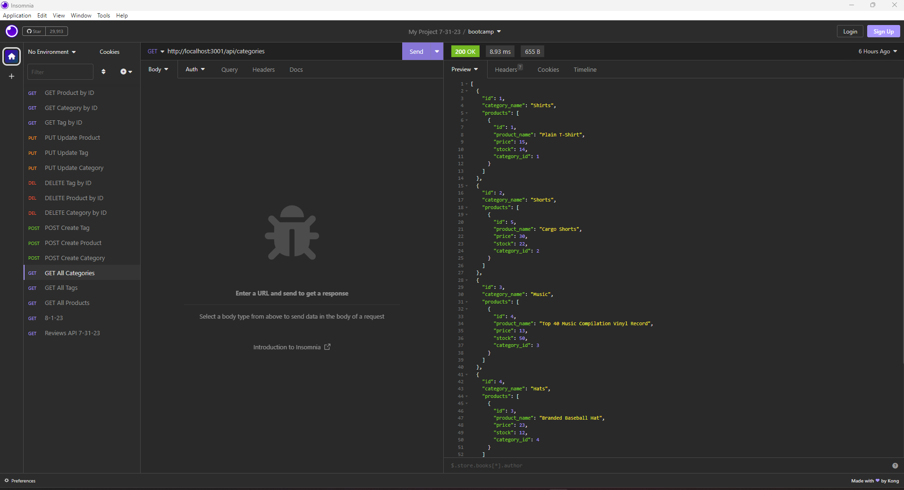

# ORM E-Commerce Back End

## Description/What I attempted to do

Build the back end for an e-commerce site by configuring an Express.js API to use Sequelize and a MySQL database. I built this application as a way to store and modify inventory data. As part of this project, I learned how to seed a database and use Express.js, Sequelize and MySQL together.

## Table of Contents

### [Usage](#usage)

### [License](#license)

### [Contributing](#contributing)

### [Questions](#questions)

## Usage

The GET, POST, PUT and DELETE routes were run through Insomnia to show how they work. The user can view all categories, products and tags; view one category, product or tag; update a category, product or tag; submit a new category, product or tag; or delete a category, product or tag.

## License

The license for this project is MIT and the link for license information is https://opensource.org/licenses/MIT.

## Contributing/Acknowledgements

Tips from University of Minnesota Full Stack Bootcamp instructor Gary Almes and notes from class sessions.

Information on Sequelize located here: https://sequelize.org/docs/v6/core-concepts/validations-and-constraints/

Information on Sequelize located here: https://stackoverflow.com/questions/53799535/is-it-possible-to-define-default-value-in-sequelize-migration

## Questions

Please find more information at my GitHub, located [here](https://github.com/Jacqueline-Stiehl).
If you have additional questions, please contact me at salsajackie@yahoo.com.

## Screen shot

## Link to the working version of the code

https://github.com/Jacqueline-Stiehl/orm-ecommerce

## Link to walkthrough video

https://watch.screencastify.com/v/JagzrlsAW8cYQZ1BSETk
